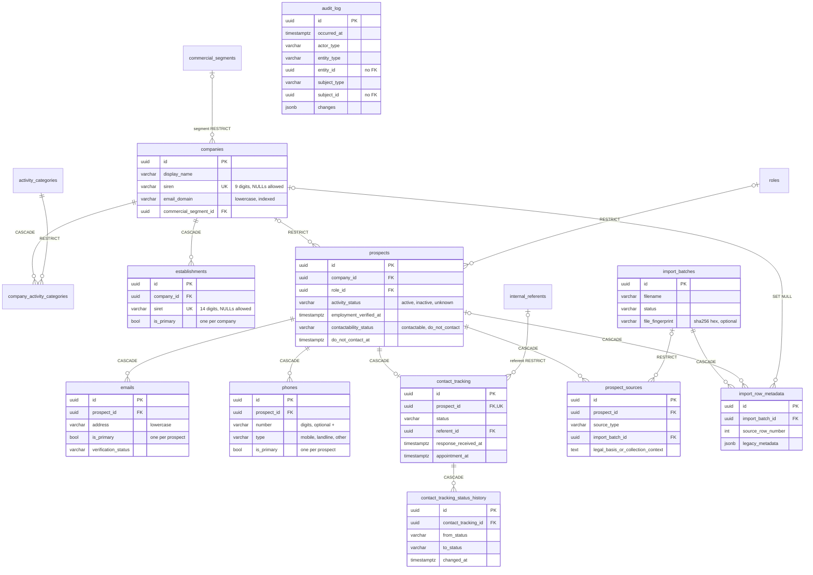

# Data Model — V1 logical contract (reviewed) and shipped physical schema

> The first part is the reviewed **logical** contract (semantics to preserve). The
> [physical schema](#physical-schema-shipped-in-task-03) at the end describes what migration `0002` actually
> creates; conventions and their rationale are in [ADR-0002](../adr/0002-data-schema-conventions.md), deviations
> in the decision log (I-09 … I-16).

## `companies`
- `id` stable UUID/ID PK
- `display_name` required
- `legal_name` nullable
- `siren` nullable, unique when present
- `website_url` nullable
- `email_domain` nullable, normalized/indexed
- `size_label` nullable (do not invent taxonomy yet)
- `commercial_segment_id` nullable
- legacy/company metadata: `project_done_with_circoe`, `project_type`, `circoe_references`, `client_approach` nullable
- timestamps

Relations: many-to-many activity categories; one-to-many establishments; one-to-many prospects.

## `establishments`
- `id`, `company_id`
- `name` nullable
- `siret` nullable, unique when present
- address fields: line1/line2/postal_code/city/country
- `kind` nullable (`siège`, `agence`, `entrepôt`, etc.)
- `is_primary`
- timestamps

Prospect is not directly linked to establishment in V1.

## `prospects`
- `id`
- `company_id` normally required after import resolution
- `civility` nullable/normalized
- `first_name`, `last_name`
- `role_id` nullable
- `exact_job_title` nullable
- `activity_status`: `active | inactive | unknown`
- `employment_verified_at` nullable; null = never verified/current employment context not verified
- `contactability_status`: `contactable | do_not_contact`
- `do_not_contact_at` nullable
- `do_not_contact_reason` nullable
- timestamps

Activity status and contactability are independent: an active employee can still be permanently blocked from prospecting.

## `roles`
Administrable taxonomy: id, label, slug, active, timestamps. Seed values are suggestions, not immutable product truth.

## `emails`
- `id`, `prospect_id`
- `address` normalized
- `is_primary`
- `is_active`
- `verification_status`: `unverified | verified | invalid | unknown`
- `origin_type`: `imported | manual | published | inferred | other`
- `last_verified_at` nullable
- `source_reference` nullable
- timestamps

Max one active primary email per prospect. Keep former addresses; never silently delete on company change.

## `phones`
Same pattern as emails:
- `id`, `prospect_id`, `number`, `type` (`mobile | landline | other`), `is_primary`, `is_active`
- verification status, origin type, last verified date, source reference, timestamps

## `commercial_segments`
Administrable taxonomy. A company has at most one primary segment.

## `activity_categories`
Administrable taxonomy with join table `company_activity_categories` for company many-to-many.

## `internal_referents`
- `id`, first_name, last_name, email nullable, active, timestamps

These are Circoe meeting/dossier referents, not application login accounts.

## `contact_tracking` (`prospections` internally if preferred)
- `id`
- `prospect_id`
- `planned_contact_at` nullable
- `status`
- `referent_id` nullable
- `response_received_at` nullable
- `appointment_at` nullable
- timestamps

Recommended current status base:
`to_contact`, `contacted`, `follow_up_1`, `follow_up_2`, `response_received`, `appointment_obtained`, `quote_sent`, `quote_follow_up`, `won`, `not_interested`.

`do_not_contact` is **not only a stage**; use the durable prospect contactability restriction. UI may present it alongside outcomes.

V1 default: one current contact-tracking row per prospect + history. Multiple independent cycles remain deferred.

## `contact_tracking_status_history`
- `id`, `contact_tracking_id`
- `from_status`, `to_status`
- `changed_at`
- `actor_id/type` or audit link

Allows derivation of first contact/follow-up/status dates without duplicating five legacy booleans.

## `prospect_sources`
Minimal provenance required by the functional spec:
- `id`, `prospect_id`
- `source_type`: `excel_import | manual | future_agent | other`
- `source_reference` nullable (file/sheet/row or URL/ref)
- `collected_at`
- `legal_basis_or_collection_context` nullable
- `created_by_actor` nullable/reference
- notes nullable

A prospect may have multiple provenance records over time.

## `import_batches`
- id, filename, sheet(s), imported_at, actor, row counts, status
- optional file fingerprint; never store sensitive raw workbook bytes in DB unless explicitly chosen

## `import_row_metadata`
- batch_id, source_sheet, source_row_number, linked prospect/company IDs
- `legacy_metadata` JSON/object for unknown or intentionally opaque legacy columns

This supports no-silent-loss without polluting first-class tables.

## `audit_log`
Append-only application audit for meaningful mutations:
- actor type/id/display snapshot (`human`, `import`, future `agent`, `system`)
- entity type/id
- action
- changed fields/before-after payload constrained to useful data
- source/context
- timestamp

## Verification UX contract

Avoid a generic field-metadata system unless implementation proves necessary. Use explicit verification scopes:
- `employment_verified_at` covers current company/role/job-title/activity context;
- each Email/Phone has its own verification status/date;
- stable identity fields (e.g. first name) carry provenance/audit but are not individually re-verified by default;
- imported dynamic values with no corresponding verification date render as warning/unverified.

This is sufficient for the requested yellow-field/section feedback while keeping the schema understandable.

---

## Physical schema (shipped in Task 03)

PostgreSQL 16, migration `backend/migrations/versions/0002_core_schema.py`, ORM models in `backend/app/models/`.
Conventions (UUID keys, `timestamptz`, text + CHECK enums, naming, deletion rules, triggers):
[ADR-0002](../adr/0002-data-schema-conventions.md).

Common to all tables unless stated: `id uuid` PK (UUIDv7 from the app, `gen_random_uuid()` fallback);
`created_at` / `updated_at timestamptz NOT NULL DEFAULT now()`, `updated_at` bumped by the `set_updated_at` trigger.

### ERD

`roles`, `commercial_segments`, `activity_categories` share one shape (below); `audit_log` has no relationships
on purpose.

### Tables

| Table | Columns (beyond `id` and timestamps) | Constraints / indexes |
|---|---|---|
| `roles`, `commercial_segments`, `activity_categories` | `label varchar(255)`, `slug varchar(100)`, `active bool DEFAULT true` | `uq_<t>_slug`; `uq_<t>_label_key` on `label_key(label)` (migration 0005: case, accents and spacing ignored); CHECK slug `^[a-z0-9]+(-[a-z0-9]+)*$`, label not blank |
| `internal_referents` | `first_name`, `last_name varchar(100)`, `email varchar(320) NULL`, `active bool` | names not blank; email lowercase `x@y`; `uq_internal_referents_name_key` on `(label_key(first_name), label_key(last_name))`, `uq_internal_referents_email` (migration 0005). Not login accounts |
| `companies` | `display_name varchar(255)`, `legal_name`, `siren varchar(9)`, `website_url text`, `email_domain varchar(253)`, `size_label varchar(100)`, `commercial_segment_id`, `project_done_with_circoe`, `project_type`, `circoe_references`, `client_approach` (text, legacy context) | `uq_companies_siren`; CHECK siren digits, email_domain lowercase `a.b`, display_name not blank; `ix_companies_email_domain`, `ix_companies_lower_display_name` |
| `company_activity_categories` | `company_id`, `activity_category_id` | composite PK; `ix_…_activity_category_id` |
| `establishments` | `company_id`, `name`, `siret varchar(14)`, `address_line1/2`, `postal_code`, `city`, `country`, `kind varchar(100)` (free text: siège, agence, entrepôt…), `is_primary bool DEFAULT false` | `uq_establishments_siret`; `uq_establishments_company_id_primary` (partial `WHERE is_primary`); CHECK siret digits |
| `prospects` | `company_id NULL`, `civility (mr/ms) NULL`, `first_name`, `last_name varchar(100) NULL`, `role_id NULL`, `exact_job_title varchar(255)`, `activity_status DEFAULT 'unknown'`, `employment_verified_at NULL`, `contactability_status DEFAULT 'contactable'`, `do_not_contact_at`, `do_not_contact_reason text` | CHECK `has_name` (at least one non-blank name); CHECK `do_not_contact_consistency`; trigger `guard_do_not_contact`; `ix_prospects_lower_last_name_first_name` |
| `emails` | `prospect_id`, `address varchar(320)`, `is_primary DEFAULT false`, `is_active DEFAULT true`, `verification_status DEFAULT 'unverified'`, `origin_type` (no default), `last_verified_at`, `source_reference text` | `uq_emails_prospect_id_address`; `uq_emails_prospect_id_primary` (partial); CHECK address lowercase `x@y`, primary ⇒ active; `ix_emails_address` |
| `phones` | as `emails`, with `number varchar(21)` and `type` | `uq_phones_prospect_id_number`; `uq_phones_prospect_id_primary` (partial); CHECK number `^\+?[0-9]{4,20}$`, primary ⇒ active; `ix_phones_number` |
| `contact_tracking` | `prospect_id`, `planned_contact_at`, `status DEFAULT 'to_contact'`, `referent_id NULL`, `response_received_at`, `appointment_at` | `uq_contact_tracking_prospect_id` (one current row per prospect); `ix_contact_tracking_referent_id` |
| `contact_tracking_status_history` | `contact_tracking_id`, `from_status NULL` (initial), `to_status`, `changed_at DEFAULT clock_timestamp()`, `actor_type`, `actor_id`, `actor_display` | CHECK `from_status IS DISTINCT FROM to_status`; index `(contact_tracking_id, changed_at)`; no `updated_at` |
| `prospect_sources` | `prospect_id`, `source_type`, `source_reference text`, `import_batch_id NULL`, `collected_at DEFAULT now()`, `legal_basis_or_collection_context text`, `actor_type/actor_id/actor_display NULL`, `notes text` | FK indexes |
| `import_batches` | `filename`, `sheet_names text[] DEFAULT '{}'`, `file_fingerprint varchar(64) NULL`, `status DEFAULT 'pending'`, `rows_total/rows_imported/rows_skipped int DEFAULT 0`, `committed_at NULL`, `legal_basis_or_collection_context text NULL`, `source_reference text NULL` (migration 0006, Task 09), `actor_type/actor_id/actor_display` | CHECK fingerprint `^[0-9a-f]{64}$`, counts ≥ 0, `committed` ⇔ `committed_at`. No workbook bytes |
| `import_row_metadata` | `import_batch_id`, `source_sheet`, `source_row_number int`, `prospect_id NULL`, `company_id NULL`, `legacy_metadata jsonb DEFAULT '{}'`, `created_at` only | `uq_import_row_metadata_batch_sheet_row`; CHECK row number > 0 |
| `audit_log` | `occurred_at DEFAULT clock_timestamp()`, `actor_type`, `actor_id varchar(128) NULL`, `actor_display`, `entity_type varchar(64)`, `entity_id uuid NULL`, `subject_type varchar(64) NULL`, `subject_id uuid NULL` (migration 0004), `action varchar(64)`, `changes jsonb DEFAULT '{}'`, `context jsonb DEFAULT '{}'` | triggers `append_only` (UPDATE/DELETE) and `no_truncate`; indexes `occurred_at`, `(entity_type, entity_id, occurred_at)`, `(subject_type, subject_id, occurred_at)`; no FKs. Event schema, vocabulary and payload policy: [audit-and-provenance.md](audit-and-provenance.md) |

Every FK column is the leading column of a non-partial index (checked by a test).

Global search (migration 0007, [ADR-0017](../adr/0017-global-search-trigram-indexes.md)): the `pg_trgm` extension,
the immutable functions `search_key(text)` (`unaccent` + lowercase) and `person_search_key(first_name, last_name)`, and
GIN trigram indexes `ix_prospects_person_search_key_trgm`, `ix_emails_address_trgm`, `ix_phones_number_trgm`,
`ix_companies_display_name_search_key_trgm`, `ix_companies_legal_name_search_key_trgm`,
`ix_establishments_name_search_key_trgm`, `ix_establishments_city_search_key_trgm` —
[global-search.md](../features/global-search.md).

`label_key(text)` (migration 0005, [ADR-0009](../adr/0009-settings-value-uniqueness.md)) is an immutable SQL function
over the `unaccent` extension: trimmed, whitespace collapsed, unaccented, lowercase. Settings services compare and
search labels through it; behaviour of the Settings values (stable slug, deactivation, delete-if-unused):
[settings-taxonomies.md](../features/settings-taxonomies.md).

### Fixed value sets (`varchar(32)` + CHECK `ck_<table>_<column>`)

| Column(s) | Values |
|---|---|
| `prospects.civility` | `mr`, `ms` (UI `M.`, `Mme`) |
| `prospects.activity_status` | `active`, `inactive`, `unknown` |
| `prospects.contactability_status` | `contactable`, `do_not_contact` |
| `emails/phones.verification_status` | `unverified`, `verified`, `invalid`, `unknown` |
| `emails/phones.origin_type` | `imported`, `manual`, `published`, `inferred`, `other` |
| `phones.type` | `mobile`, `landline`, `other` |
| `contact_tracking.status`, history `from_status` / `to_status` | `to_contact`, `contacted`, `follow_up_1`, `follow_up_2`, `response_received`, `appointment_obtained`, `quote_sent`, `quote_follow_up`, `won`, `not_interested` — **no `do_not_contact`** |
| `prospect_sources.source_type` | `excel_import`, `manual`, `future_agent`, `other` |
| `import_batches.status` | `pending`, `committed`, `failed`, `cancelled` |
| `*.actor_type` | `human`, `import`, `system`, `agent` |

Python source of truth: `backend/app/models/enums.py` and `backend/app/core/actor.py` (`ActorType`).

### Deletion rules

RESTRICT for every taxonomy/referent reference, company → prospects and import batch → prospect sources; CASCADE
for a company's establishments and category links, for everything owned by a prospect (emails, phones, contact
tracking and its history, sources, import row metadata) and for a batch's row metadata; SET NULL for
`import_row_metadata.company_id`. A `do_not_contact` prospect cannot be deleted. Rationale: ADR-0002.

### Domain rules at the service boundary

- **Contactability** (`app/services/prospects.py`): `mark_do_not_contact` (idempotent, keeps the first date) and
  `clear_do_not_contact` (mandatory reason; the only path the `guard_do_not_contact` trigger accepts). Contact
  tracking (`app/services/contact_tracking.py`) never reads or writes contactability; `not_interested` is an outcome,
  not an opposition.
- **Company change** (`change_company`): sets the new company, clears `employment_verified_at` (NULL = current
  employment context not verified) and moves every **active** email/phone from `verified` to `unverified`, keeping
  `last_verified_at`; `invalid`/`unknown` and inactive (former) channels are left as they are; nothing is deleted.
  In V1 every active channel counts as company-dependent (B2B contact base). Audited as
  `prospect.company_changed` with both company ids and names; each re-verified channel as `email/phone.updated`.
- **Prospection segments** (Task 14, `app/services/prospection/segments.py`): the canonical reading of these columns —
  never verified, re-check, due, contacted, no response, responses, appointments, e-mail states — used by the
  Prospection counters and list and by Home ([prospection-kpis.md](../features/prospection-kpis.md)).
- **Contact tracking** (`save_contact_tracking`): creates or replaces the single current row and appends a
  status-history row (with the actor snapshot) whenever the status changes.
- **Prospect editor** (Task 15, `app/services/prospect_editor.py` + `contact_channels.py`,
  [prospect-editor.md](../features/prospect-editor.md), [ADR-0015](../adr/0015-prospect-editor-save.md)): one atomic save
  composing an inline role creation, `change_company`, the identity/employment fields, the e-mail and phone **full
  lists** (normalized like the import; exactly one active primary, switched in two flushes; removals deleted), the
  contact tracking and, on creation, a `manual` provenance source. Verification is explicit: the employment through an
  action (`keep`, `verified_now`, `verified_on` a day, `clear`), each alias through `verified_now` — a `verified` status
  is otherwise kept only for an alias already verified and unchanged, so a company change is never undone by the
  payload; an edited value is a new, never-verified `manual` one. Contactability has its own operation with a reason
  both ways; the save cannot carry it. Writes check an **aggregate version** (the prospect, its e-mails, phones and
  tracking) under a row lock and refuse stale ones (409). A `do_not_contact` prospect cannot be deleted.
- **Companies** (Task 07, `app/services/companies.py`, [company-editor.md](../features/company-editor.md)): SIREN/SIRET
  stored as digits with a valid Luhn key when entered or changed (La Poste SIRETs by digit sum; unchanged imported
  values are not re-checked), unique with a 409 naming the holding company; `email_domain` lowercase without `@`,
  scheme or `www.`, webmail domains refused; establishments saved with their company as a full list with exactly one
  primary when any; a company is deleted only without prospects, its establishments first (each audited).
- **Import commit** (Task 09, `app/services/import_commit.py`, [excel-import-export.md](../features/excel-import-export.md)):
  one savepoint per commit; prospects created through `prospects.create_prospect` (channels `imported`,
  `unverified`, employment never verified) or completed with fill-empty merge rules (`add_channels`,
  `change_company` only when the prospect has no company); existing companies completed through
  `companies.complete_company`; a failed commit leaves only a `failed` batch.
- **Audit and provenance** (Task 05): every service annotates the rows it changes and one flush hook writes the
  `audit_log` events; `prospect_sources` and import batches are written through `ProvenanceService` /
  `import_batches` — see [audit-and-provenance.md](audit-and-provenance.md). The do-not-contact clearing reason is
  kept in the `prospect.do_not_contact.cleared` event (`context.reason`).

### Seeds

`python -m app.seed [--db test]` (from `backend/`) inserts suggested values only when neither their slug nor their
label exists and never modifies existing rows: roles *Dirigeant*, *Responsable logistique*, *Responsable
d'exploitation*, *Responsable transport*; segments *Transporteur*, *Logisticien*, *Chargeur*; activity categories
*Transport routier de marchandises*, *Entreposage et stockage*, *Messagerie et fret express*, *Affrètement et
commission de transport*. No companies, prospects or referents are seeded.

---

## Authentication tables (Task 04, migration `0003`)

Not part of the domain model: login accounts and their sessions ([ADR-0004](../adr/0004-authentication-sessions.md)).
`users` has no relationship with `internal_referents` (Circoe people named on dossiers) in either direction.

| Table | Columns (beyond `id`) | Constraints / indexes |
|---|---|---|
| `users` | `email varchar(320)`, `display_name varchar(255)`, `password_hash varchar(255)` (argon2id PHC string), `created_at`, `updated_at` (trigger) | `uq_users_email`; CHECK email lowercase `x@y`, display name not blank |
| `user_sessions` | `user_id` → `users` ON DELETE CASCADE, `token_hash varchar(64)` (SHA-256 hex of the cookie token), `created_at`, `last_seen_at`, `expires_at` (absolute limit), `revoked_at NULL` | `uq_user_sessions_token_hash`; `ix_user_sessions_user_id`; CHECK token hash `^[0-9a-f]{64}$`; no `updated_at` |

Actor snapshots elsewhere (`actor_id`) hold `users.id` as text for human actors; they are not foreign keys
(ADR-0002), so deleting an account never rewrites history.
